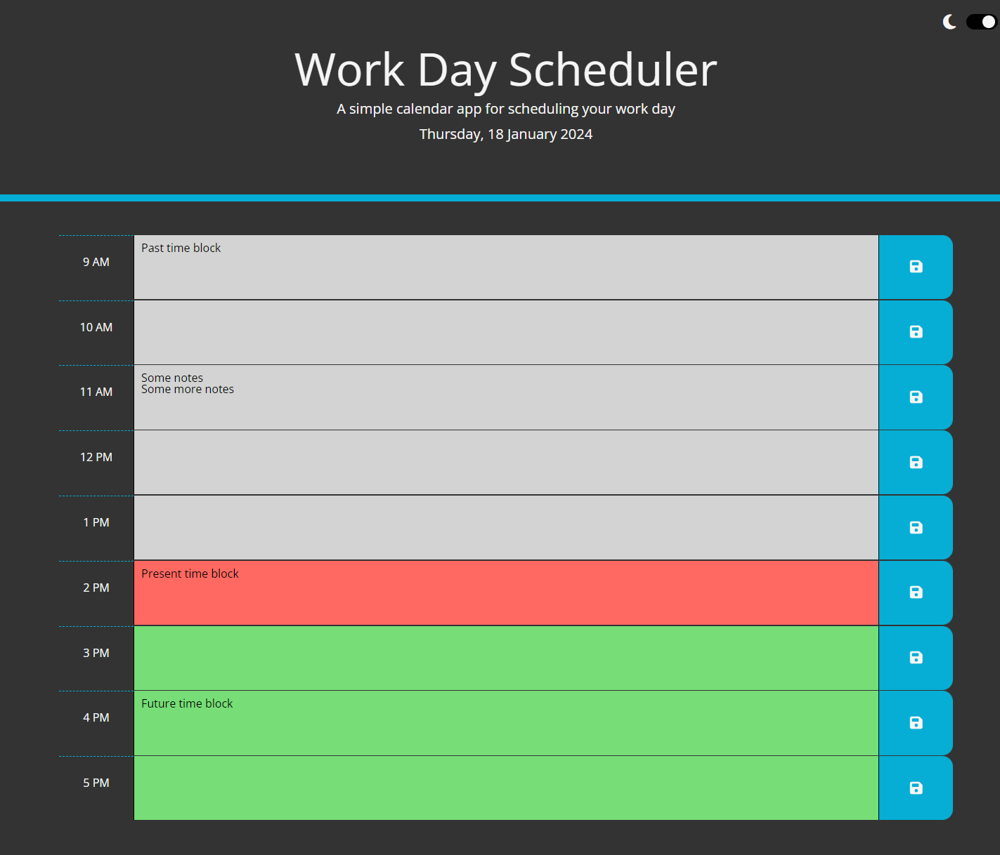
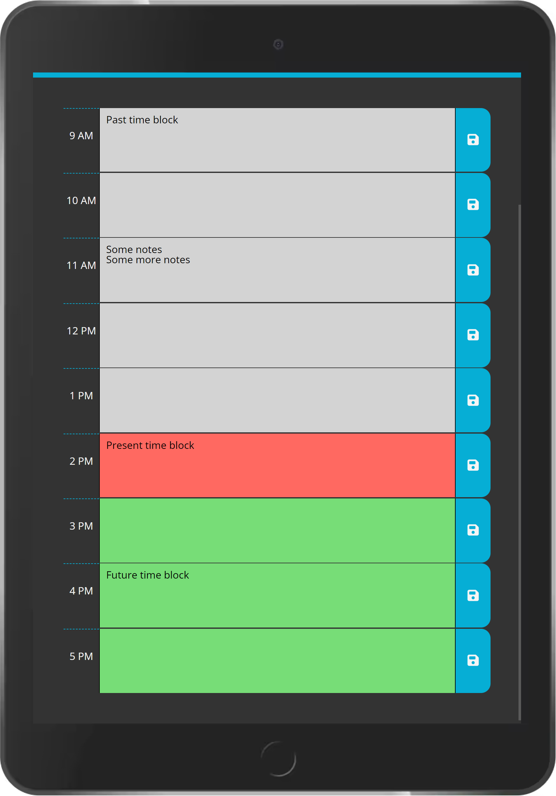
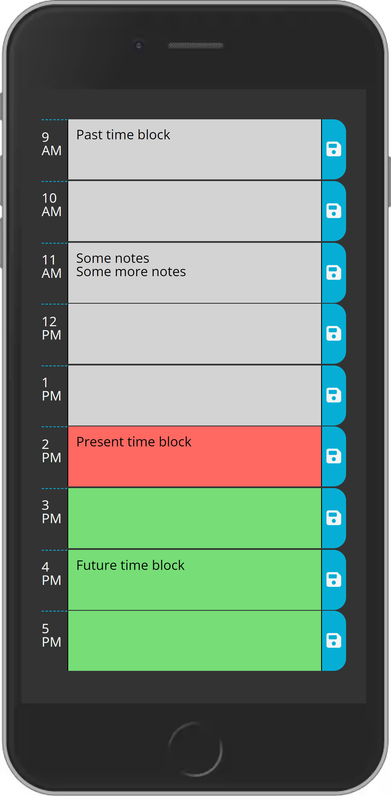

# Work Day Scheduler

A day planner powered by jQuery that allows you to enter and save events to Local Storage.

[**Deployed Project**](https://sebzg.github.io/Work-Day-Scheduler/)

##

### Usage

- Simply click on the timeblock you wish to add an entry to and click the save button.
- The entries are saved on your Local Storage and will be there on refresh.
- For dark mode simply click on the the dark mode button to toggle between light and dark - preference is also saved on Local Storage.

##

### Resources

- [**W3 School**](https://www.w3schools.com/)
- [**MDN Web Docs**](https://developer.mozilla.org/)

##

### Desktop

##

### Tablet

##

### Mobile

